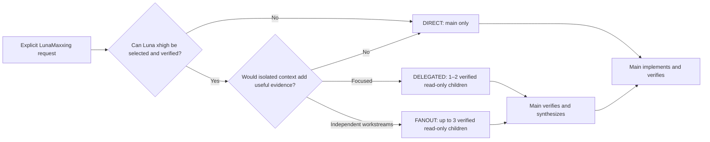

<div align="center">

# LunaMaxxing

**Explicit, quality-first Codex orchestration for Luna Max with bounded Luna xhigh subagents.**

[](https://developers.openai.com/codex/)
[](https://github.com/HakanBabus/LunaMaxxing/actions/workflows/test.yml)
[](LICENSE)

[English](README.md) · [Türkçe](README.tr.md) · [Install](#installation) · [Routes](#adaptive-routes)

</div>

---

LunaMaxxing keeps the **Luna Max main session** in control and selectively delegates bounded investigation, review, or independent reasoning to native **Luna xhigh subagents** when delegation can materially improve the answer.

It is not a replacement model and it does not start separate processes. It is a compact orchestration policy for getting more value from evidence, independent checks, and deliberate synthesis without turning every task into a large pipeline.

> [!IMPORTANT]
> LunaMaxxing is **explicit-only**. It runs only when you invoke `$lunamaxxing` or directly ask Codex to use the lunamaxxing skill. Mentions of Luna Max, quality, deep analysis, planning, debugging, or verification do not activate it.

## Core model

| Role | Preferred runtime | Responsibility |
| --- | --- | --- |
| Main | Luna Max (`gpt-5.6-luna`, `max`) | Own context, decisions, writing, verification, and final response |
| Native subagent | Verified Luna (`gpt-5.6-luna`, `xhigh`) only | Read-only investigation, challenge, or review |

Delegation is allowed only when the native runtime can explicitly select, enforce, and reliably verify Luna xhigh for the child, preferably through returned runtime metadata. Requesting xhigh is not proof that it was used. **Unverified xhigh means DIRECT with no delegation.** LunaMaxxing never inherits a different child model or effort and never creates an external CLI/process fallback.

## Why use it?

- **Explicit-only:** no surprise activation.
- **Adaptive delegation:** 0–2 children normally; hard maximum 3 total sessions and 3 concurrent children per run.
- **Main-only writer:** every subagent is read-only; Main Luna Max owns all implementation and file changes.
- **No recursive delegation:** only main may create subagents.
- **Bounded lifecycle:** reviewer, retry, and follow-up calls consume the same total budget; failed children are not automatically replaced.
- **Evidence receipts:** every delegated result carries findings, evidence, confidence, risks, and a next action.
- **Low ceremony:** small deterministic tasks remain direct.

## Installation

Ask Codex to install the skill from this repository:

```text
Use $skill-installer to install lunamaxxing from
https://github.com/HakanBabus/LunaMaxxing/tree/main/skills/lunamaxxing
```

Or install manually:

```powershell
python "$env:USERPROFILE\.codex\skills\.system\skill-installer\scripts\install-skill-from-github.py" `
  --repo HakanBabus/LunaMaxxing `
  --path skills/lunamaxxing
```

## Usage

```text
Use $lunamaxxing to investigate this intermittent state-loss bug, implement the verified fix, and test regressions.
```

```text
Use the lunamaxxing skill to audit this repository and fix only evidence-backed issues.
```

## Adaptive routes



### DIRECT

No subagent. Best for typos, small fixes, obvious one-file refactors, and linear low-risk work.

### DELEGATED

Usually 1–2 focused, verified Luna xhigh subagents. Best for uncertain bugs, cross-component reconnaissance, an independent alternative, or final diff review.

### FANOUT

At most 3 independent, verified Luna xhigh subagents. Reserved for repository-wide audits, complex regressions, or architecture decisions with separable evidence lanes. Difficulty alone is not enough.

The limit is **3 total child sessions per run**, not merely 3 active at once. Reviewers, retries, and the single permitted bounded follow-up all count. Subagents are read-only and compete on **information**, not implementation. Main verifies critical receipts before deciding and remains the only writer.

### Child lifecycle

- `DONE`: main checks and uses the receipt.
- `DONE_WITH_CONCERNS`: main evaluates the concerns before deciding.
- `NEEDS_CONTEXT`: main may send at most one bounded follow-up; that follow-up consumes one unit of the same child-session budget.
- `BLOCKED` or `FAILED`: no automatic replacement child is opened.

A completed child is closed. Child failure does not grant a new child session.

## Repository structure

```text
LunaMaxxing/
├─ .github/workflows/test.yml
├─ evals/
│  ├─ evaluate-routing.ps1
│  └─ routing-scenarios.json
├─ skills/lunamaxxing/
│  ├─ SKILL.md
│  ├─ agents/openai.yaml
│  └─ references/delegation-playbook.md
├─ tests/test-lunamaxxing.ps1
├─ README.md
├─ README.tr.md
├─ CONTRIBUTING.md
└─ LICENSE
```

## Validation

The cross-platform suite checks explicit-only activation, strict xhigh verification, the 3-total/3-concurrent limits, bounded child lifecycle, main-only writing, task packets, structured receipts, repository-wide removal of the previous process architecture, README parity, and executable routing scenarios.

```powershell
pwsh -NoProfile -File ./tests/test-lunamaxxing.ps1
```

## Limits

- Runtime support determines whether a child can actually be pinned to Luna xhigh.
- If Luna xhigh cannot be enforced and reliably verified, the route is DIRECT; requesting it is not verification.
- No external CLI or process fallback is used.
- Delegation improves process quality; it does not make Luna intrinsically equivalent to a stronger model.
- Destructive actions, external writes, credentials, purchases, and production changes still require normal authorization.

## Contributing

Focused issues and pull requests are welcome. See [CONTRIBUTING.md](CONTRIBUTING.md).

## License

Released under the [MIT License](LICENSE).
