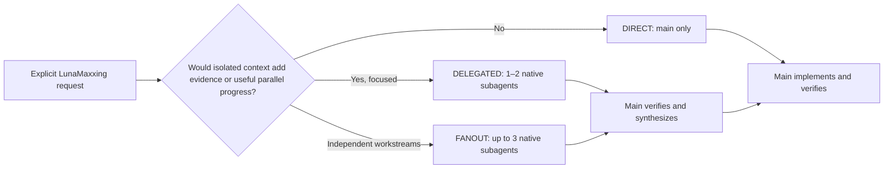

<div align="center">

# LunaMaxxing

**Explicit, quality-first native orchestration for Luna Max.**

[](https://developers.openai.com/codex/)
[](https://github.com/HakanBabus/LunaMaxxing/actions/workflows/test.yml)
[](LICENSE)

[English](README.md) · [Türkçe](README.tr.md) · [Install](#installation) · [Routes](#adaptive-routes)

</div>

---

LunaMaxxing keeps the **Luna Max main session** in control and selectively delegates bounded investigation, review, or independent reasoning to native **Luna xhigh subagents** when delegation can materially improve the answer.

It is not a replacement model and it does not start separate processes. It is a compact orchestration policy for getting more value from evidence, independent checks, and deliberate synthesis without turning every task into a large pipeline.

> [!IMPORTANT]
> LunaMaxxing is **explicit-only**. It runs only when you invoke `$lunamaxxing` or directly ask Codex to use the lunamaxxing skill. Mentions of Luna Max, quality, deep analysis, planning, debugging, or verification do not activate it.

## Core model

| Role | Preferred runtime | Responsibility |
| --- | --- | --- |
| Main | Luna Max (`gpt-5.6-luna`, `max`) | Own context, decisions, writing, verification, and final response |
| Native subagent | Luna (`gpt-5.6-luna`, `xhigh`) when runtime-supported | Focused investigation, challenge, or review |

If native model/effort overrides cannot be verified, LunaMaxxing uses the runtime's available native delegation or stays DIRECT. It never creates a separate process to force xhigh.

## Why use it?

- **Explicit-only:** no surprise activation.
- **Adaptive delegation:** 0–2 subagents normally, hard maximum 3.
- **Main as writer:** subagents investigate and review by default.
- **No recursive delegation:** only main may create subagents.
- **Safe parallel writing:** allowed only with disjoint file ownership; overlapping files always have one writer.
- **Evidence receipts:** every delegated result carries findings, evidence, confidence, risks, and a next action.
- **Low ceremony:** small deterministic tasks remain direct.

## Installation

Ask Codex to install the skill from this repository:

```text
Use $skill-installer to install lunamaxxing from
https://github.com/HakanBabus/LunaMaxxing/tree/main/skills/lunamaxxing
```

Or install manually:

```powershell
python "$env:USERPROFILE\.codex\skills\.system\skill-installer\scripts\install-skill-from-github.py" `
  --repo HakanBabus/LunaMaxxing `
  --path skills/lunamaxxing
```

## Usage

```text
Use $lunamaxxing to investigate this intermittent state-loss bug, implement the verified fix, and test regressions.
```

```text
Use the lunamaxxing skill to audit this repository and fix only evidence-backed issues.
```

## Adaptive routes



### DIRECT

No subagent. Best for typos, small fixes, obvious one-file refactors, and linear low-risk work.

### DELEGATED

Usually 1–2 focused subagents. Best for uncertain bugs, cross-component reconnaissance, an independent alternative, or final diff review.

### FANOUT

At most 3 independent subagents. Reserved for repository-wide audits, complex regressions, or architecture decisions with separable evidence lanes. Difficulty alone is not enough.

Subagents compete on **information**, not duplicated implementation. Main verifies critical receipts before deciding.

## Repository structure

```text
LunaMaxxing/
├─ .github/workflows/test.yml
├─ evals/routing-scenarios.json
├─ skills/lunamaxxing/
│  ├─ SKILL.md
│  ├─ agents/openai.yaml
│  └─ references/delegation-playbook.md
├─ tests/test-lunamaxxing.ps1
├─ README.md
├─ README.tr.md
├─ CONTRIBUTING.md
└─ LICENSE
```

## Validation

The cross-platform suite checks explicit-only activation, route definitions, the 0–3 limit, recursive-delegation prevention, writer ownership, task packets, structured receipts, native child fallback, removal of the previous process-based architecture, README parity, and representative routing scenarios.

```powershell
pwsh -NoProfile -File ./tests/test-lunamaxxing.ps1
```

## Limits

- Runtime support determines whether a child can actually be pinned to Luna xhigh.
- The skill reports model/effort only when verified.
- Delegation improves process quality; it does not make Luna intrinsically equivalent to a stronger model.
- Destructive actions, external writes, credentials, purchases, and production changes still require normal authorization.

## Contributing

Focused issues and pull requests are welcome. See [CONTRIBUTING.md](CONTRIBUTING.md).

## License

Released under the [MIT License](LICENSE).
