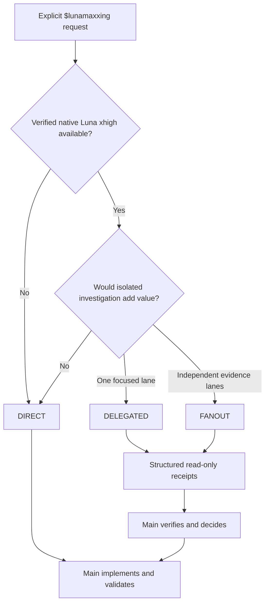

<div align="center">

# LunaMaxxing

### More deliberate Luna Max. Only when you ask for it.

**Explicit, quality-first Codex orchestration for Luna Max with bounded Luna xhigh subagents.**

[](https://developers.openai.com/codex/)
[](https://github.com/HakanBabus/LunaMaxxing/actions/workflows/test.yml)
[](LICENSE)

[English](README.md) · [Türkçe](README.tr.md) · [Install](#install) · [How it works](#how-it-works) · [Safety contract](#safety-contract)

</div>

---

LunaMaxxing is a Codex skill that gives **Luna Max** a disciplined way to investigate, decide, implement, and verify difficult work. The current Luna Max session remains in control. Native **Luna xhigh** children may be used for focused investigation or review—but only when the runtime can prove that exact model and effort were selected.

> [!IMPORTANT]
> **Nothing happens automatically.** LunaMaxxing is explicit-only: invoke `$lunamaxxing` or directly ask Codex to use the lunamaxxing skill. Requests for “better quality,” “deep analysis,” or “more planning” do not activate it.

## The idea in 30 seconds

| | Main session | Native children |
| --- | --- | --- |
| Runtime | Luna Max · `gpt-5.6-luna` · `max` | Verified `gpt-5.6-luna` · `xhigh` only |
| Role | Task owner, decision maker, verifier | Focused investigator or reviewer |
| Writes files? | **Yes — Main is the only writer** | **No — always read-only** |
| Limit | One main session | 0–2 normally, **3 total** at most |

If native Luna xhigh cannot be explicitly selected, enforced, and reliably verified, the task stays **DIRECT**. A requested override is not proof. There is no inherited substitute model and no external CLI/process fallback.

## Why LunaMaxxing?

Luna Max is inexpensive enough to spend more time on careful work. LunaMaxxing turns that advantage into a bounded workflow instead of simply asking the model to “think harder.”

- **Evidence before confidence** — findings must point to files, commands, behavior, or other checkable evidence.
- **Adaptive depth** — small work stays small; uncertain work gets independent investigation when it will help.
- **One coherent implementation** — children research and review, while Main owns every change.
- **Bounded cost and complexity** — no recursion, no replacement swarm, and no more than 3 total child sessions.
- **Deliberate verification** — Main checks material claims and validates the final result.

### When it earns its keep

| Reach for `$lunamaxxing` | Keep the normal workflow |
| --- | --- |
| Root cause is uncertain or intermittent | The cause and fix are already proven |
| Several independent parts of a repository need inspection | The task is a linear change in one known area |
| An architecture choice benefits from an independent challenge | The decision is reversible and low impact |
| A high-impact change deserves a separate read-only review | Delegation would only repeat Main's work |

## Install

Ask Codex to install the skill directly from GitHub:

```text
Use $skill-installer to install lunamaxxing from
https://github.com/HakanBabus/LunaMaxxing/tree/main/skills/lunamaxxing
```

Or install it manually:

```powershell
python "$env:USERPROFILE\.codex\skills\.system\skill-installer\scripts\install-skill-from-github.py" `
  --repo HakanBabus/LunaMaxxing `
  --path skills/lunamaxxing
```

Then start a request with `$lunamaxxing`:

```text
$lunamaxxing Investigate this intermittent state-loss bug, implement the verified fix, and test regressions.
```

## How it works



### Adaptive routes

| Route | Children | Good fit | Example |
| --- | ---: | --- | --- |
| **DIRECT** | 0 | Clear, linear, or indivisible work | Known typo, proven root-cause bug, single-file refactor |
| **DELEGATED** | 1–2 | One or two focused investigations can reduce uncertainty | Intermittent state bug, alternative design check, final diff review |
| **FANOUT** | Up to 3 | The task has genuinely independent evidence lanes | Repository-wide audit across runtime, architecture, and tests |

Difficulty alone does not justify delegation. The useful question is: **will isolated context produce new evidence or independent verification?**

## Safety contract

### Strict xhigh verification

Children are created only when all of these are true:

1. The native runtime supports subagents.
2. `gpt-5.6-luna` with `xhigh` can be explicitly selected for the child.
3. The selection can be enforced and reliably verified, preferably from returned runtime metadata.
4. The run still has child-session budget available.

**Unverified xhigh = no delegation.** The task continues DIRECT in the main session.

### Hard limits

- Default: **0–2 children**.
- Maximum: **3 total child sessions** and **3 concurrent children** per `$lunamaxxing` run.
- Every spawn and follow-up turn counts, including reviewer and retry work.
- Recursive delegation is forbidden.
- A failed child is not automatically replaced.

### Child lifecycle

| Receipt status | Main's response |
| --- | --- |
| `DONE` | Check material claims, then use the receipt. |
| `DONE_WITH_CONCERNS` | Evaluate the concerns before deciding. |
| `NEEDS_CONTEXT` | At most one bounded follow-up; it consumes the same budget. |
| `BLOCKED` / `FAILED` | Do not open an automatic replacement child. |

Completed children are closed. Child failure never creates extra budget.

## Structured handoff

Every delegated task receives a bounded task packet and returns a structured receipt:

```text
Task packet                         Receipt
───────────                         ───────
GOAL                                STATUS
SCOPE                               SUMMARY
RELEVANT_PATHS                      FINDINGS
KNOWN_EVIDENCE                      EVIDENCE
QUESTION_TO_ANSWER                  CONFIDENCE
CONSTRAINTS                         RISKS
FORBIDDEN_ACTIONS                   RECOMMENDED_NEXT_ACTION
EXPECTED_OUTPUT
```

Receipts are claims, not proof. Main remains responsible for verification, implementation, and the final answer.

## More examples

```text
$lunamaxxing Audit this repository for evidence-backed reliability issues. Fix only validated findings.
```

```text
Use the lunamaxxing skill. Compare two viable architectures, verify the important assumptions, then implement one.
```

```text
$lunamaxxing Diagnose this regression. Keep the work DIRECT if the root cause becomes obvious.
```

## Validation

The lightweight test suite checks the explicit-only trigger, routing behavior, strict xhigh fallback, total child budget, lifecycle rules, main-only writer policy, README parity, and removal of the old process-based architecture.

```powershell
pwsh -NoProfile -File ./tests/test-lunamaxxing.ps1
```

Routing scenarios can also be run separately:

```powershell
pwsh -NoProfile -File ./evals/evaluate-routing.ps1
```

Tests run on both Windows and Ubuntu through GitHub Actions.

## Repository map

```text
LunaMaxxing/
├─ skills/lunamaxxing/
│  ├─ SKILL.md                         # Core policy and routing
│  ├─ agents/openai.yaml               # Codex skill metadata
│  └─ references/delegation-playbook.md # Task packets, receipts, lifecycle
├─ evals/
│  ├─ routing-scenarios.json           # Behavioral cases
│  └─ evaluate-routing.ps1             # Lightweight routing evaluator
├─ tests/test-lunamaxxing.ps1          # Contract and consistency tests
└─ .github/workflows/test.yml          # Windows + Ubuntu CI
```

Start with the [core skill policy](skills/lunamaxxing/SKILL.md), then read the [delegation playbook](skills/lunamaxxing/references/delegation-playbook.md) for task packets, receipts, and lifecycle details.

## Limits

- Runtime support determines whether Luna xhigh can be pinned and verified.
- LunaMaxxing improves the work process; it does not make Luna intrinsically equivalent to a stronger model.
- Normal authorization boundaries still apply to destructive actions, external writes, credentials, purchases, and production changes.

## Contributing

Focused issues and pull requests are welcome. See [CONTRIBUTING.md](CONTRIBUTING.md).

## License

Released under the [MIT License](LICENSE).
