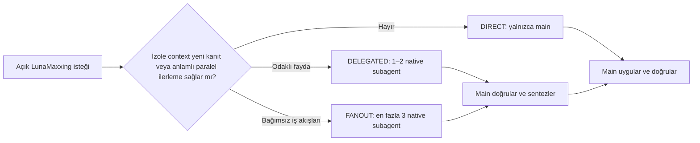

<div align="center">

# LunaMaxxing

**Luna Max için açıkça çağrılan, kalite odaklı native orchestration.**

[](https://developers.openai.com/codex/)
[](https://github.com/HakanBabus/LunaMaxxing/actions/workflows/test.yml)
[](LICENSE)

[English](README.md) · [Türkçe](README.tr.md) · [Kurulum](#kurulum) · [Rotalar](#uyarlanabilir-rotalar)

</div>

---

LunaMaxxing, **Luna Max ana oturumunu** görevin sahibi olarak tutar; delegation gerçekten fayda sağlayacaksa sınırlı araştırma, bağımsız doğrulama veya review işlerini native **Luna xhigh subagent'lara** verir.

Bu bir model değişimi değildir ve ayrı CLI process'leri başlatmaz. Her görevi ağır bir pipeline'a çevirmeden kanıt, bağımsız kontrol ve bilinçli sentezden daha fazla fayda almayı sağlayan sade bir orchestration politikasıdır.

> [!IMPORTANT]
> LunaMaxxing **yalnızca açıkça çağrılırsa** çalışır. `$lunamaxxing` kullanmalı veya Codex'e doğrudan lunamaxxing skillini kullanmasını söylemelisin. Luna Max, kalite, derin analiz, planlama, debugging veya doğrulama kelimeleri tek başına skill'i etkinleştirmez.

## Temel model

| Rol | Tercih edilen runtime | Sorumluluk |
| --- | --- | --- |
| Main | Luna Max (`gpt-5.6-luna`, `max`) | Context, karar, yazma, doğrulama ve final cevap |
| Native subagent | Runtime destekliyorsa Luna (`gpt-5.6-luna`, `xhigh`) | Odaklı araştırma, challenge veya review |

Native model/effort override doğrulanamıyorsa LunaMaxxing runtime'ın sunduğu native delegation'ı kullanır veya DIRECT kalır. xhigh zorlamak için terminal process'i ya da harici worker oluşturmaz.

## Neden kullanılır?

- **Explicit-only:** sürpriz biçimde devreye girmez.
- **Uyarlanabilir delegation:** normalde 0–2, kesin üst sınır 3 subagent.
- **Main varsayılan writer:** subagent'lar öncelikle araştırır ve review yapar.
- **Recursive delegation yok:** yalnızca main subagent oluşturabilir.
- **Güvenli paralel yazma:** yalnızca dosya sahipliği tamamen ayrılmışsa; kesişen dosyalarda tek writer vardır.
- **Kanıt receipt'leri:** her sonuç bulgu, kanıt, güven, risk ve sonraki eylem içerir.
- **Az bürokrasi:** küçük ve açık görevler doğrudan çözülür.

## Kurulum

Codex'ten bu repository'den yüklemesini iste:

```text
Use $skill-installer to install lunamaxxing from
https://github.com/HakanBabus/LunaMaxxing/tree/main/skills/lunamaxxing
```

Veya elle yükle:

```powershell
python "$env:USERPROFILE\.codex\skills\.system\skill-installer\scripts\install-skill-from-github.py" `
  --repo HakanBabus/LunaMaxxing `
  --path skills/lunamaxxing
```

## Kullanım

```text
Use $lunamaxxing to investigate this intermittent state-loss bug, implement the verified fix, and test regressions.
```

```text
Bu repository'yi incelemek ve yalnızca kanıtlı sorunları düzeltmek için lunamaxxing skillini kullan.
```

## Uyarlanabilir rotalar



### DIRECT

Subagent yoktur. Typo, küçük fix, açık tek dosya refactor'ü ve doğrusal düşük riskli işler için uygundur.

### DELEGATED

Genellikle 1–2 odaklı subagent kullanır. Belirsiz bug, component'lar arası reconnaissance, bağımsız alternatif veya final diff review için uygundur.

### FANOUT

En fazla 3 bağımsız subagent kullanır. Repository genelindeki audit, karmaşık regression veya ayrılabilir kanıt alanları olan mimari kararlar içindir. Görevin yalnızca zor olması yeterli değildir.

Subagent'lar tekrar eden implementation üzerinde değil, **bilgi üzerinde** yarışır. Main karar vermeden önce kritik receipt'leri doğrular.

## Repository yapısı

```text
LunaMaxxing/
├─ .github/workflows/test.yml
├─ evals/routing-scenarios.json
├─ skills/lunamaxxing/
│  ├─ SKILL.md
│  ├─ agents/openai.yaml
│  └─ references/delegation-playbook.md
├─ tests/test-lunamaxxing.ps1
├─ README.md
├─ README.tr.md
├─ CONTRIBUTING.md
└─ LICENSE
```

## Doğrulama

Platformlar arası test; explicit-only davranışını, route tanımlarını, 0–3 sınırını, recursive delegation yasağını, writer sahipliğini, task packet ve structured receipt sözleşmelerini, native child fallback'ini, eski harici-worker mimarisinin kaldırılmasını, README uyumunu ve örnek route senaryolarını kontrol eder.

```powershell
pwsh -NoProfile -File ./tests/test-lunamaxxing.ps1
```

## Sınırlar

- Child'ın gerçekten Luna xhigh olarak sabitlenebilmesi runtime desteğine bağlıdır.
- Skill yalnızca doğrulayabildiği model/effort bilgisini raporlar.
- Delegation süreci iyileştirir; Luna'yı yapısal olarak daha güçlü bir modele eşitlemez.
- Yıkıcı işlemler, harici yazmalar, kimlik bilgileri, satın almalar ve production değişiklikleri normal yetki sınırlarına tabidir.

## Katkıda bulunma

Odaklı issue ve pull request'ler kabul edilir. Ayrıntılar için [CONTRIBUTING.md](CONTRIBUTING.md) dosyasına bak.

## Lisans

[MIT Lisansı](LICENSE) altında yayımlanmıştır.
