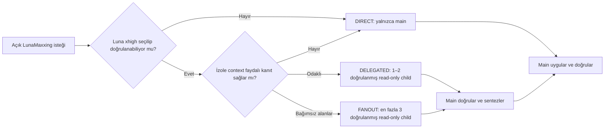

<div align="center">

# LunaMaxxing

**Luna Max için sınırlı Luna xhigh subagent'larla explicit, kalite odaklı Codex orchestration.**

[](https://developers.openai.com/codex/)
[](https://github.com/HakanBabus/LunaMaxxing/actions/workflows/test.yml)
[](LICENSE)

[English](README.md) · [Türkçe](README.tr.md) · [Kurulum](#kurulum) · [Rotalar](#uyarlanabilir-rotalar)

</div>

---

LunaMaxxing, **Luna Max ana oturumunu** görevin sahibi olarak tutar; delegation gerçekten fayda sağlayacaksa sınırlı araştırma, bağımsız doğrulama veya review işlerini native **Luna xhigh subagent'lara** verir.

Bu bir model değişimi değildir ve ayrı process'ler başlatmaz. Her görevi ağır bir pipeline'a çevirmeden kanıt, bağımsız kontrol ve bilinçli sentezden daha fazla fayda almayı sağlayan sade bir orchestration politikasıdır.

> [!IMPORTANT]
> LunaMaxxing **yalnızca açıkça çağrılırsa** çalışır. `$lunamaxxing` kullanmalı veya Codex'e doğrudan lunamaxxing skillini kullanmasını söylemelisin. Luna Max, kalite, derin analiz, planlama, debugging veya doğrulama kelimeleri tek başına skill'i etkinleştirmez.

## Temel model

| Rol | Tercih edilen runtime | Sorumluluk |
| --- | --- | --- |
| Main | Luna Max (`gpt-5.6-luna`, `max`) | Context, karar, yazma, doğrulama ve final cevap |
| Native subagent | Yalnızca doğrulanmış Luna (`gpt-5.6-luna`, `xhigh`) | Read-only araştırma, challenge veya review |

Delegation yalnızca native runtime child için Luna xhigh'ı açıkça seçebiliyor, enforce edebiliyor ve tercihen returned runtime metadata ile güvenilir biçimde doğrulayabiliyorsa kullanılabilir. Yalnızca xhigh istemek, kullanıldığının kanıtı değildir. **Doğrulanmamış xhigh → DIRECT; delegation yok.** Başka child model/effort inherit edilmez ve harici CLI/process fallback oluşturulmaz.

## Neden kullanılır?

- **Explicit-only:** sürpriz biçimde devreye girmez.
- **Uyarlanabilir delegation:** normalde 0–2 child; çalışma başına en fazla 3 total session ve 3 concurrent child.
- **Main tek writer:** bütün subagent'lar read-only'dir; implementation ve dosya değişiklikleri Main Luna Max'a aittir.
- **Recursive delegation yok:** yalnızca main subagent oluşturabilir.
- **Sınırlı lifecycle:** reviewer, retry ve follow-up çağrıları aynı total bütçeden düşer; başarısız child otomatik değiştirilmez.
- **Kanıt receipt'leri:** her sonuç bulgu, kanıt, güven, risk ve sonraki eylem içerir.
- **Az bürokrasi:** küçük ve açık görevler doğrudan çözülür.

## Kurulum

Codex'ten bu repository'den yüklemesini iste:

```text
Use $skill-installer to install lunamaxxing from
https://github.com/HakanBabus/LunaMaxxing/tree/main/skills/lunamaxxing
```

Veya elle yükle:

```powershell
python "$env:USERPROFILE\.codex\skills\.system\skill-installer\scripts\install-skill-from-github.py" `
  --repo HakanBabus/LunaMaxxing `
  --path skills/lunamaxxing
```

## Kullanım

```text
Use $lunamaxxing to investigate this intermittent state-loss bug, implement the verified fix, and test regressions.
```

```text
Bu repository'yi incelemek ve yalnızca kanıtlı sorunları düzeltmek için lunamaxxing skillini kullan.
```

## Uyarlanabilir rotalar



### DIRECT

Subagent yoktur. Typo, küçük fix, açık tek dosya refactor'ü ve doğrusal düşük riskli işler için uygundur.

### DELEGATED

Genellikle 1–2 odaklı, doğrulanmış Luna xhigh subagent kullanır. Belirsiz bug, component'lar arası reconnaissance, bağımsız alternatif veya final diff review için uygundur.

### FANOUT

En fazla 3 bağımsız, doğrulanmış Luna xhigh subagent kullanır. Repository genelindeki audit, karmaşık regression veya ayrılabilir kanıt alanları olan mimari kararlar içindir. Görevin yalnızca zor olması yeterli değildir.

Sınır aynı anda açık child sayısı değil, çalışma boyunca **3 total child session**'dır. Reviewer, retry ve izin verilen tek bounded follow-up da buna dahildir. Subagent'lar read-only'dir ve implementation yerine **bilgi üzerinde** yarışır. Main kritik receipt'leri doğrular ve tek writer olarak kalır.

### Child lifecycle

- `DONE`: main receipt'i kontrol edip kullanır.
- `DONE_WITH_CONCERNS`: main concern'leri değerlendirir.
- `NEEDS_CONTEXT`: en fazla bir bounded follow-up verilebilir; bu follow-up aynı child-session bütçesinden bir birim düşer.
- `BLOCKED` veya `FAILED`: otomatik replacement child açılmaz.

Tamamlanan child kapalı kabul edilir. Child failure yeni child açma yetkisi vermez.

## Repository yapısı

```text
LunaMaxxing/
├─ .github/workflows/test.yml
├─ evals/
│  ├─ evaluate-routing.ps1
│  └─ routing-scenarios.json
├─ skills/lunamaxxing/
│  ├─ SKILL.md
│  ├─ agents/openai.yaml
│  └─ references/delegation-playbook.md
├─ tests/test-lunamaxxing.ps1
├─ README.md
├─ README.tr.md
├─ CONTRIBUTING.md
└─ LICENSE
```

## Doğrulama

Platformlar arası test; explicit-only davranışını, strict xhigh doğrulamasını, 3 total/3 concurrent sınırını, bounded child lifecycle'ını, main-only writer politikasını, task packet ve structured receipt sözleşmelerini, eski process mimarisinin repo genelinden kaldırılmasını, README uyumunu ve çalıştırılabilir routing senaryolarını kontrol eder.

```powershell
pwsh -NoProfile -File ./tests/test-lunamaxxing.ps1
```

## Sınırlar

- Child'ın gerçekten Luna xhigh olarak sabitlenebilmesi runtime desteğine bağlıdır.
- Luna xhigh enforce edilip güvenilir biçimde doğrulanamıyorsa route DIRECT olur; yalnızca istemek doğrulama değildir.
- Harici CLI veya process fallback kullanılmaz.
- Delegation süreci iyileştirir; Luna'yı yapısal olarak daha güçlü bir modele eşitlemez.
- Yıkıcı işlemler, harici yazmalar, kimlik bilgileri, satın almalar ve production değişiklikleri normal yetki sınırlarına tabidir.

## Katkıda bulunma

Odaklı issue ve pull request'ler kabul edilir. Ayrıntılar için [CONTRIBUTING.md](CONTRIBUTING.md) dosyasına bak.

## Lisans

[MIT Lisansı](LICENSE) altında yayımlanmıştır.
