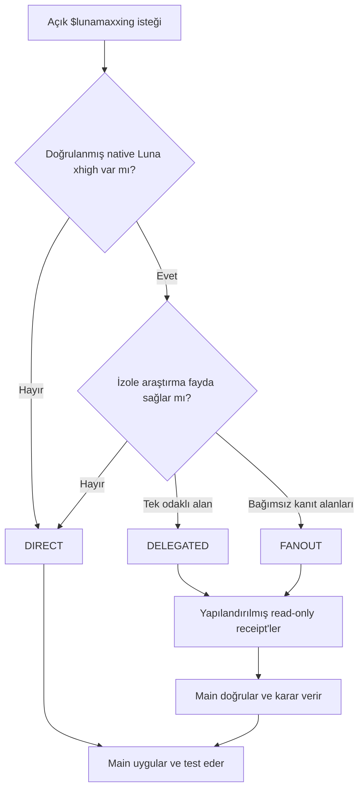

<div align="center">

# LunaMaxxing

### Luna Max daha bilinçli çalışsın. Ama yalnızca sen istediğinde.

**Luna Max için sınırlı Luna xhigh subagent'lara sahip, açıkça çağrılan ve kaliteyi önceleyen Codex orkestrasyonu.**

[](https://developers.openai.com/codex/)
[](https://github.com/HakanBabus/LunaMaxxing/actions/workflows/test.yml)
[](LICENSE)

[English](README.md) · [Türkçe](README.tr.md) · [Kurulum](#kurulum) · [Nasıl çalışır?](#nasıl-çalışır) · [Güvenlik sözleşmesi](#güvenlik-sözleşmesi)

</div>

---

LunaMaxxing, **Luna Max**'ın zor işleri araştırması, karara bağlaması, uygulaması ve doğrulaması için disiplinli bir çalışma düzeni sunan Codex skillidir. Mevcut Luna Max oturumu her zaman kontrolü elinde tutar. Native **Luna xhigh** child'lar yalnızca odaklı araştırma ve review için, runtime seçilen model ile effort seviyesini gerçekten kanıtlayabiliyorsa kullanılır.

> [!IMPORTANT]
> **Kendiliğinden hiçbir zaman devreye girmez.** LunaMaxxing explicit-only çalışır: `$lunamaxxing` yazmalı veya Codex'e doğrudan lunamaxxing skillini kullanmasını söylemelisin. “Daha kaliteli yap”, “derin analiz et” ya da “iyi planla” gibi istekler skill'i etkinleştirmez.

## 30 saniyede temel fikir

| | Ana oturum | Native child'lar |
| --- | --- | --- |
| Runtime | Luna Max · `gpt-5.6-luna` · `max` | Yalnızca doğrulanmış `gpt-5.6-luna` · `xhigh` |
| Görev | İşin sahibi, karar verici, doğrulayıcı | Odaklı araştırmacı veya reviewer |
| Dosya yazabilir mi? | **Evet — Main tek writer** | **Hayır — her zaman read-only** |
| Sınır | Tek ana oturum | Normalde 0–2, en fazla **3 total** |

Native Luna xhigh açıkça seçilemiyor, enforce edilemiyor ve güvenilir biçimde doğrulanamıyorsa görev **DIRECT** kalır. Yalnızca override istemek kanıt değildir. Başka bir model inherit edilmez ve harici CLI/process fallback kullanılmaz.

## Neden LunaMaxxing?

Luna Max, dikkatli çalışmaya daha fazla zaman ayırmanın ekonomik olduğu bir modeldir. LunaMaxxing bu avantajı modele yalnızca “daha çok düşün” demek yerine sınırlı ve denetlenebilir bir iş akışına dönüştürür.

- **Önce kanıt** — bulgular dosya, komut, gerçek davranış veya kontrol edilebilir başka bir kanıta dayanır.
- **Göreve göre derinlik** — küçük işler küçük kalır; belirsiz işler faydalıysa bağımsız araştırma alır.
- **Tek ve tutarlı uygulama** — child'lar araştırır ve review yapar; bütün değişiklikleri Main yapar.
- **Sınırlı maliyet ve karmaşıklık** — recursive delegation, replacement sürüsü ve 3 total child session'ı aşmak yoktur.
- **Bilinçli doğrulama** — Main önemli iddiaları kontrol eder ve final sonucu test eder.

### Ne zaman gerçekten fayda sağlar?

| `$lunamaxxing` kullan | Normal iş akışında kal |
| --- | --- |
| Root cause belirsiz veya sorun aralıklıysa | Sebep ve çözüm zaten kanıtlandıysa |
| Repository'nin birkaç bağımsız alanı incelenecekse | Görev bilinen tek bir alanda doğrusal ilerliyorsa |
| Mimari karar bağımsız bir challenge'dan fayda görecekse | Karar geri alınabilir ve düşük etkiliyse |
| Yüksek etkili değişiklik ayrı bir read-only review hak ediyorsa | Delegation yalnızca Main'in işini tekrar edecekse |

## Kurulum

Codex'ten skilli doğrudan GitHub üzerinden kurmasını iste:

```text
Use $skill-installer to install lunamaxxing from
https://github.com/HakanBabus/LunaMaxxing/tree/main/skills/lunamaxxing
```

İstersen elle de kurabilirsin:

```powershell
python "$env:USERPROFILE\.codex\skills\.system\skill-installer\scripts\install-skill-from-github.py" `
  --repo HakanBabus/LunaMaxxing `
  --path skills/lunamaxxing
```

Ardından isteğine `$lunamaxxing` ile başla:

```text
$lunamaxxing Bu aralıklı state kaybı sorununu araştır, doğrulanmış düzeltmeyi uygula ve regresyon testlerini çalıştır.
```

## Nasıl çalışır?



### Uyarlanabilir rotalar

| Rota | Child | Ne zaman uygun? | Örnek |
| --- | ---: | --- | --- |
| **DIRECT** | 0 | Açık, doğrusal veya bölünemeyen iş | Bilinen typo, root-cause'u kanıtlanmış bug, tek dosya refactor'ü |
| **DELEGATED** | 1–2 | Bir veya iki odaklı araştırma belirsizliği azaltabilir | Aralıklı state bug'ı, alternatif tasarım kontrolü, final diff review |
| **FANOUT** | En fazla 3 | Görev gerçekten bağımsız kanıt alanlarına ayrılabilir | Runtime, mimari ve testler olarak bölünen repo geneli audit |

Bir görevin yalnızca zor olması delegation için yeterli değildir. Asıl soru şudur: **İzole context yeni kanıt veya bağımsız doğrulama sağlayacak mı?**

## Güvenlik sözleşmesi

### Strict xhigh doğrulaması

Child yalnızca şu koşulların tamamı sağlanıyorsa oluşturulur:

1. Native runtime subagent özelliğini desteklemeli.
2. Child için `gpt-5.6-luna` ve `xhigh` açıkça seçilebilmeli.
3. Bu seçim enforce edilebilmeli ve tercihen dönen runtime metadata üzerinden güvenilir biçimde doğrulanabilmeli.
4. Çalışmanın child-session bütçesinde yer kalmış olmalı.

**Doğrulanmamış xhigh = delegation yok.** Görev ana oturumda DIRECT devam eder.

### Kesin sınırlar

- Varsayılan: **0–2 child**.
- Üst sınır: Her `$lunamaxxing` çalışmasında **3 total child session** ve **3 concurrent child**.
- Reviewer ve retry işleri dahil her spawn ve follow-up turu bütçeden düşer.
- Recursive delegation yasaktır.
- Başarısız child otomatik olarak yenisiyle değiştirilmez.

### Child lifecycle

| Receipt durumu | Main'in davranışı |
| --- | --- |
| `DONE` | Önemli iddiaları kontrol eder, ardından receipt'i kullanır. |
| `DONE_WITH_CONCERNS` | Karar vermeden önce concern'leri değerlendirir. |
| `NEEDS_CONTEXT` | En fazla bir bounded follow-up verir; aynı bütçeden düşer. |
| `BLOCKED` / `FAILED` | Otomatik replacement child açmaz. |

Tamamlanan child kapalı kabul edilir. Child failure hiçbir zaman ek bütçe oluşturmaz.

## Yapılandırılmış devir

Her delegated görev sınırlı bir task packet alır ve yapılandırılmış receipt döndürür:

```text
Task packet                         Receipt
───────────                         ───────
GOAL                                STATUS
SCOPE                               SUMMARY
RELEVANT_PATHS                      FINDINGS
KNOWN_EVIDENCE                      EVIDENCE
QUESTION_TO_ANSWER                  CONFIDENCE
CONSTRAINTS                         RISKS
FORBIDDEN_ACTIONS                   RECOMMENDED_NEXT_ACTION
EXPECTED_OUTPUT
```

Receipt'ler kanıt değil, kontrol edilmesi gereken iddialardır. Doğrulama, implementation ve final cevap her zaman Main'in sorumluluğundadır.

## Daha fazla kullanım örneği

```text
$lunamaxxing Bu repository'yi kanıta dayalı güvenilirlik sorunları için incele. Yalnızca doğrulanmış bulguları düzelt.
```

```text
Lunamaxxing skillini kullan. İki uygulanabilir mimariyi karşılaştır, önemli varsayımları doğrula ve ardından birini uygula.
```

```text
$lunamaxxing Bu regresyonu teşhis et. Root cause açık hale gelirse DIRECT devam et.
```

## Doğrulama

Hafif test paketi; explicit-only tetiklemeyi, routing davranışını, strict xhigh fallback'ini, total child bütçesini, lifecycle kurallarını, main-only writer politikasını, README uyumunu ve eski process tabanlı mimarinin kaldırıldığını kontrol eder.

```powershell
pwsh -NoProfile -File ./tests/test-lunamaxxing.ps1
```

Routing senaryoları ayrıca çalıştırılabilir:

```powershell
pwsh -NoProfile -File ./evals/evaluate-routing.ps1
```

Testler GitHub Actions üzerinde hem Windows hem Ubuntu'da çalışır.

## Repository haritası

```text
LunaMaxxing/
├─ skills/lunamaxxing/
│  ├─ SKILL.md                         # Temel politika ve routing
│  ├─ agents/openai.yaml               # Codex skill metadata
│  └─ references/delegation-playbook.md # Task packet, receipt ve lifecycle
├─ evals/
│  ├─ routing-scenarios.json           # Davranış senaryoları
│  └─ evaluate-routing.ps1             # Hafif routing evaluator
├─ tests/test-lunamaxxing.ps1          # Sözleşme ve tutarlılık testleri
└─ .github/workflows/test.yml          # Windows + Ubuntu CI
```

Önce [temel skill politikasını](skills/lunamaxxing/SKILL.md), task packet, receipt ve lifecycle ayrıntıları için ardından [delegation playbook'unu](skills/lunamaxxing/references/delegation-playbook.md) okuyabilirsin.

## Sınırlar

- Luna xhigh'ın seçilip doğrulanabilmesi runtime desteğine bağlıdır.
- LunaMaxxing çalışma sürecini iyileştirir; Luna'yı yapısal olarak daha güçlü bir modele eşitlemez.
- Yıkıcı işlemler, harici yazmalar, kimlik bilgileri, satın almalar ve production değişikliklerinde normal yetki sınırları geçerlidir.

## Katkıda bulunma

Odaklı issue ve pull request'ler kabul edilir. Ayrıntılar için [CONTRIBUTING.md](CONTRIBUTING.md) dosyasına bak.

## Lisans

[MIT Lisansı](LICENSE) altında yayımlanmıştır.
